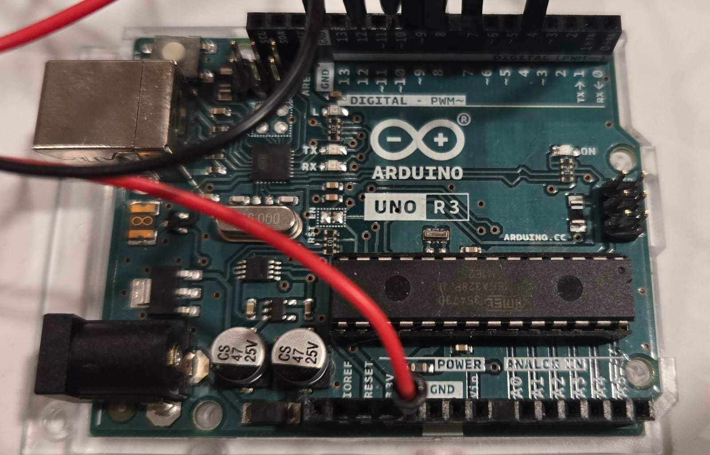
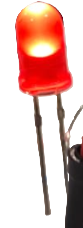
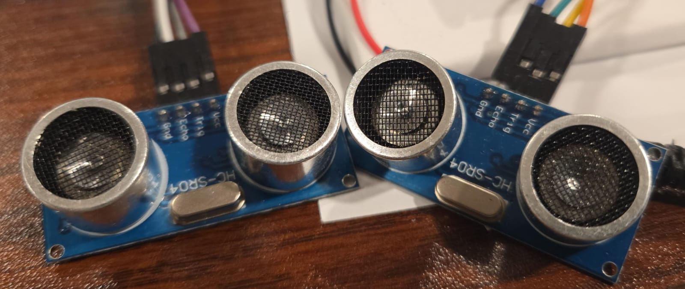
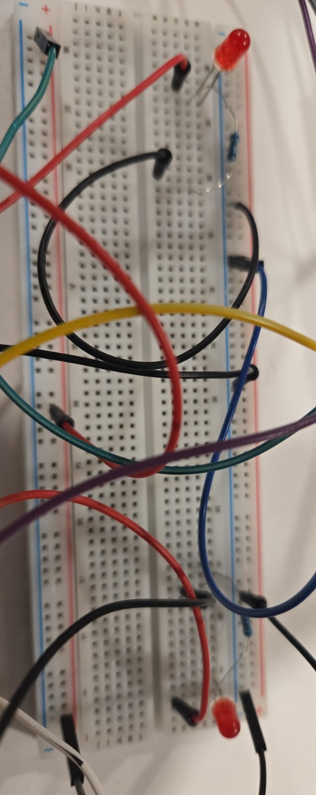
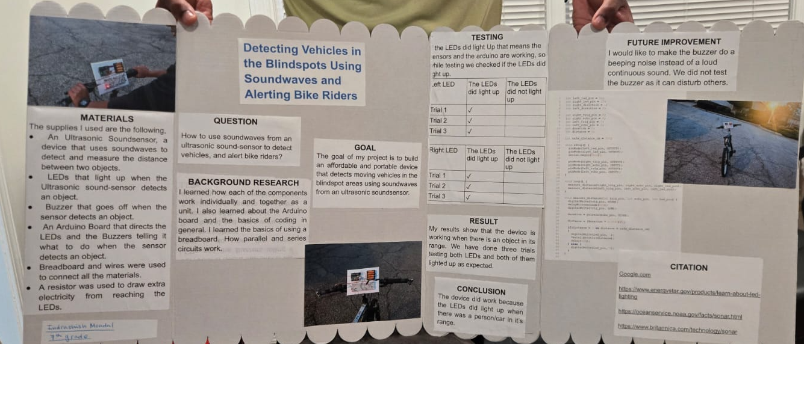
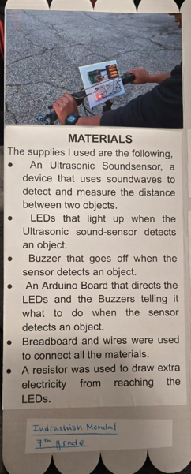
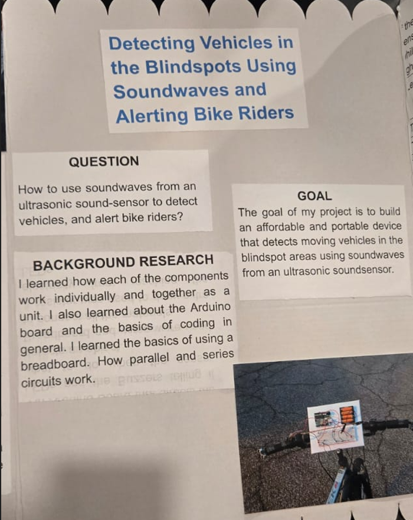
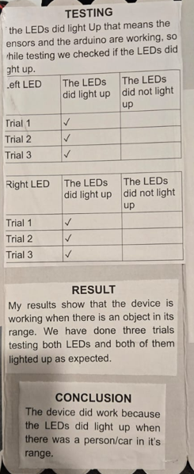
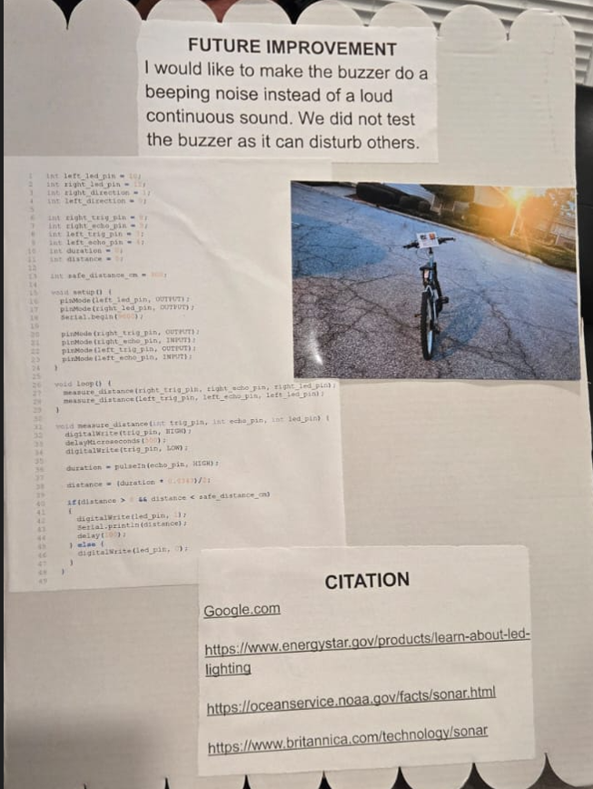

# grade-7-science-fair
This repository has details about my seventh grade science fair. 

## Introduction
Many people ride there bikes everyday, and sometimes it is really hard to know if a car is near you especially when the car is near the blindspot. It is a problem which I have seen personally, and something that can cause accidents. During the 2025-2026 science fair, I created a device that can detect cars nearby and alert bike riders.

## Problem and Solution
The problem that I was solving was bike riders sometimes are not aware of cars near by especially when the car is near the blindspot. The solution that I created was a device that uses an Arduino board, LED lights, and an ultrasonic soundsensor. 

## Materials
The materials that I used were 
* **Arduino board**  

* **LED lights**  

* **Ultrasonic Soundsensor**  
  

* **Breadboard**  
  

* **I used wires to connect all the materials.**

## Presentation
* **Presentation Board**  
  

* **Materials Info**  
  

* **Question, Goal, and Background Research**  
   

* **Testing**  
   

* **Code and Sources**  
  

## Steps
1. I wrote the code. 
2. I attached the materials. 
3. I tested the device.